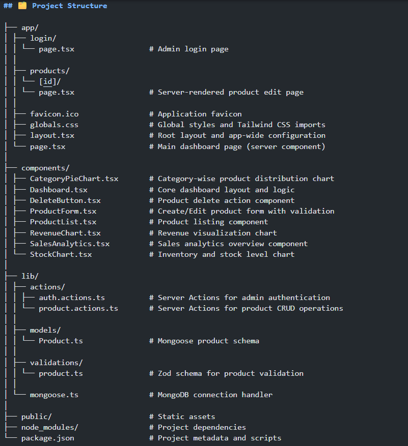
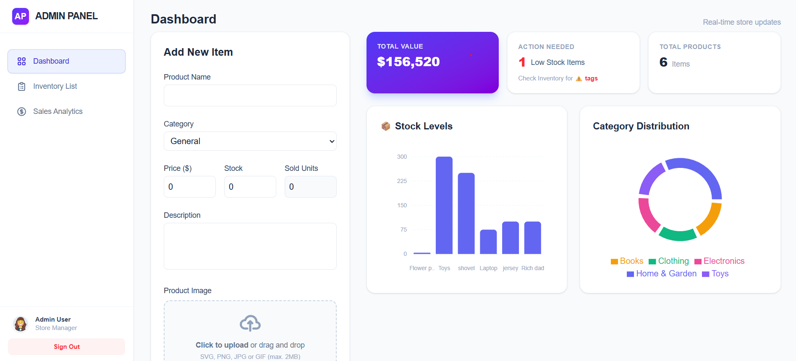
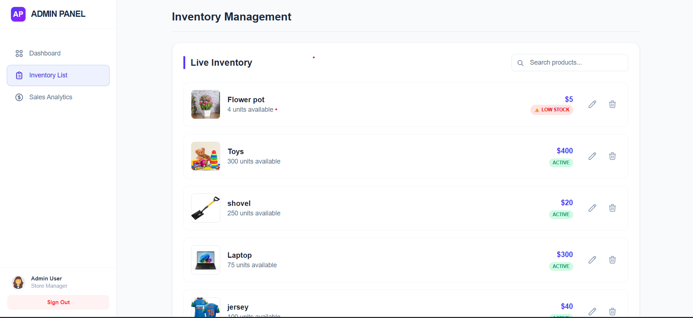
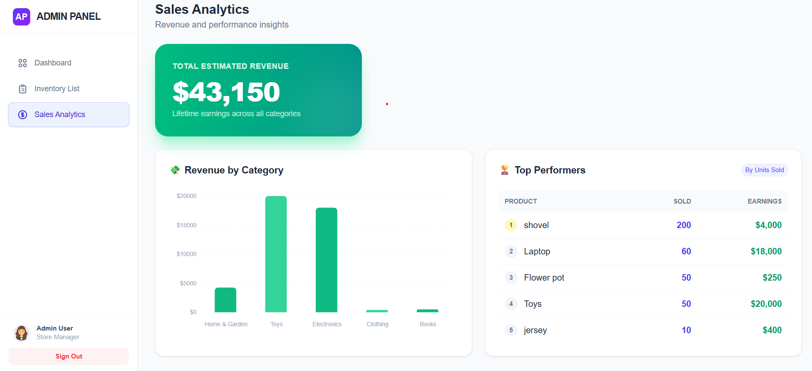

## 📊 Server-Rendered E-Commerce Product Management Dashboard

A production-grade administrative dashboard for managing products in an e-commerce system, built using Next.js (App Router) with a strong focus on Server-Side Rendering (SSR), performance, and scalability.

This project demonstrates how modern full-stack applications can leverage server components and server actions to deliver fast, SEO-friendly, and reliable admin experiences.

🌐 Live Access
Deployment: [https://ecommerce-dashboard-lujf.vercel.app/](https://ecommerce-dashboard-lujf.vercel.app/)

Repository: [https://github.com/mokshjain6174/ecommerce-dashboard](https://github.com/mokshjain6174/ecommerce-dashboard)

Demo Video: [https://drive.google.com/file/d/1-fKD7J5cdT7rVwt8Toy8_5e8GO-Wo3M1/view?usp=sharing](https://drive.google.com/file/d/1-fKD7J5cdT7rVwt8Toy8_5e8GO-Wo3M1/view?usp=sharing)
---

## 🔐 Admin Login Credentials (Required)

⚠️ **Important:**  
You must use the following credentials to access the dashboard.  
Without these credentials, the application **cannot be accessed**.

**Email:** `admin@store.com`  
**Password:** `1234`

---

## 📌 Project Overview

This dashboard is designed for administrators to efficiently manage an e-commerce product catalog.
All critical data is fetched and rendered on the server, reducing client-side complexity and improving initial load performance.

The system supports:

Secure admin access

Complete product lifecycle management

Real-time data visualization

Optimized image handling for large inventories

## 🎯 Key Objectives

- Implement **Server-Side Rendering** for faster page loads and better SEO 

- Build a real-world **CRUD dashboard** using modern full-stack patterns  

- Eliminate unnecessary client-side API calls using **Next.js Server Actions**  

- Maintain strong **data validation and integrity** across the system  

- Design a **scalable structure** suitable for production use  

---

## ✨ Core Features

### 🔄 Server-Side Rendering (SSR)
- Pages are rendered on the server using **Next.js App Router**
- Improves performance, SEO, and consistency across devices

### 📦 Product Management (CRUD)
- Create, update, view, and delete products
- Dynamic routes for product editing
- Server-validated mutations

### 📝 Advanced Forms & Validation
- Robust form handling with **Zod**
- Prevents invalid or inconsistent product data

### 📊 Data Visualization
- Interactive charts built with **Recharts**
- Visual representation of inventory and stock trends
- Helps administrators make data-driven decisions

### 🖼️ Secure Image Uploads
- Images stored and optimized using **Cloudinary**
- Offloads heavy image processing from the server
- Ensures faster delivery and reduced bandwidth usage

---

## 🛠️ Technical Architecture
Category      Technology                Purpose
Framework     Next.js 16 (App Router)   High-performance full-stack framework with SSR.
Logic Layer   Server Actions            "Direct server mutations for secure, efficient data handling."
Integrity     Zod                       Advanced schema validation for all inputs.
Visuals       Recharts                  Interactive SVG-based charts for management metrics.
Storage       Cloudinary                Scalable cloud storage for product media assets.
Database      MongoDB                   Flexible NoSQL storage for complex product attributes.

## 🔄 Core Workflow
Server Initialization: When an admin requests a page, the server fetches the required product data directly from MongoDB.

SSR Delivery: The page is fully rendered on the server and sent as a complete HTML document, providing instant visibility.

Client Hydration: The browser hydrates the page, enabling interactive Recharts and real-time form updates.

Secure Mutation: Actions like creating or deleting products are handled via Next.js Server Actions, which run exclusively on the server to protect sensitive logic.

## 📂 Project Structure

## 🧠 Key Learnings

- Practical use of **Next.js Server Actions** for full-stack development  

- Clear separation of **server and client responsibilities**  

- Importance of **server-side validation** for data safety  

- Performance benefits of **SSR** over client-heavy dashboards  

- Scalable project structure suitable for real production systems 

## 📊 Dashboard Tab – Functional Summary

The **Dashboard** tab serves as the **central control panel** of the e-commerce admin system. It provides administrators with a **real-time, high-level overview** of store performance, inventory status, and product distribution, enabling quick decision-making without navigating through multiple pages.

### 🔹 Key Functionalities

#### ➕ Add New Product
- Allows administrators to create new products directly from the dashboard.
- Captures essential product details:
  - Product name
  - Category
  - Price
  - Stock quantity
  - Units sold
  - Description
  - Product image upload
- Form input is validated using server-side schemas to ensure data integrity.

#### 💰 Total Inventory Value
- Displays the **combined monetary value of all products** in inventory.
- Helps administrators understand overall stock worth at a glance.

#### ⚠️ Action Needed (Low Stock Alert)
- Highlights products with **low stock levels**.
- Alerts administrators to restock items before they run out.
- Improves inventory planning and prevents sales loss.

#### 📦 Total Products Count
- Shows the total number of active products in the system.
- Provides a quick inventory size snapshot.

#### 📊 Stock Levels Visualization
- Bar chart representing stock quantities of individual products.
- Enables easy comparison between different products.
- Helps identify overstocked and understocked items.

#### 🧩 Category Distribution
- Pie chart showing how products are distributed across categories.
- Helps understand inventory balance between different product types.
- Useful for planning category-wise expansion or reduction.

### 🔄 Real-Time Updates
- Dashboard data updates automatically after product creation, update, or deletion.
- Ensures administrators always view the latest inventory state.

---

### ✅ Purpose of the Dashboard Tab

The Dashboard tab is designed to:
- Reduce administrative workload
- Provide actionable insights at a glance
- Centralize product management and analytics
- Improve operational efficiency through visual data representation

## 📦 Inventory List Tab – Functional Summary

The **Inventory List** tab provides administrators with a **detailed, real-time view of all products** available in the system. It is designed for efficient inventory monitoring, quick product updates, and proactive stock management.

### 🔹 Key Functionalities

#### 📋 Live Inventory Listing
- Displays all products currently stored in the database.
- Each product entry includes:
  - Product image
  - Product name
  - Available stock quantity
  - Product price
  - Stock status indicator

#### 🔍 Product Search
- Search bar allows administrators to quickly locate products by name.
- Enables efficient navigation in large inventories.

#### ⚠️ Stock Status Indicators
- Products with low stock are clearly labeled as **“Low Stock”**.
- Products with sufficient stock are marked as **“Active”**.
- Helps administrators identify items requiring immediate attention.

#### ✏️ Edit Product
- Edit icon allows administrators to update product details.
- Supports modification of price, stock quantity, category, description, and image.

#### 🗑️ Delete Product
- Delete icon enables removal of products from inventory.
- Ensures outdated or unavailable products can be removed safely.

#### 🔄 Real-Time Inventory Updates
- Inventory list updates automatically after:
  - Product creation
  - Product update
  - Product deletion
- Ensures the displayed data is always current.

---

### ✅ Purpose of the Inventory List Tab

The Inventory List tab is designed to:
- Centralize product monitoring in a single view
- Improve inventory control and stock visibility
- Reduce time spent managing individual products
- Enable quick decision-making through visual stock indicators

## 📈 Sales Analytics Tab – Functional Summary

The **Sales Analytics** tab provides administrators with **insightful revenue and performance analytics** derived from product sales data. It transforms raw sales information into **visual and ranked metrics**, enabling data-driven business decisions.

### 🔹 Key Functionalities

#### 💰 Total Estimated Revenue
- Displays the **total lifetime revenue** generated across all products and categories.
- Helps administrators assess overall store performance at a glance.

#### 📊 Revenue by Category
- Bar chart visualization showing revenue contribution from each product category.
- Allows easy comparison of category-wise performance.
- Helps identify high-performing and underperforming categories.

#### 🏆 Top Performing Products
- Ranks products based on **units sold**.
- Displays:
  - Product name
  - Total units sold
  - Total earnings per product
- Helps identify best-selling and most profitable items.

#### 🔄 Performance Insights
- Combines sales volume and revenue data for clearer interpretation.
- Enables administrators to:
  - Optimize inventory restocking
  - Focus on high-revenue products
  - Improve category-level strategies

#### 📡 Real-Time Data Reflection
- Analytics update automatically when:
  - Product sales data changes
  - Inventory is updated
- Ensures metrics always reflect the latest store performance.

---

### ✅ Purpose of the Sales Analytics Tab

The Sales Analytics tab is designed to:
- Provide actionable insights into sales performance
- Support data-driven decision-making
- Identify top-performing products and categories
- Improve revenue planning and inventory optimization

## 🚀 Running the Project Locally

**1️⃣ You can verify Node.js installation using:**
node -v
npm -v

**2️⃣ Clone the Repository**
git clone https://github.com/mokshjain6174/ecommerce-dashboard.git
cd ecommerce-dashboard

**3️⃣ Install Dependencies**
npm install

**4️⃣ Configure Environment Variables**
Create a .env.local file in the root directory and add the following variables:
# MongoDB
MONGODB_URI=your_mongodb_connection_string

# Cloudinary (Image Uploads)
NEXT_PUBLIC_CLOUDINARY_CLOUD_NAME=your_cloud_name
CLOUDINARY_API_KEY=your_api_key
CLOUDINARY_API_SECRET=your_api_secret

# Admin Login Credentials
ADMIN_EMAIL=admin@store.com
ADMIN_PASSWORD=1234

**5️⃣ Run the Development Server**
npm run dev

**6️⃣ Access the Application**
Open your browser and navigate to:
http://localhost:3000

